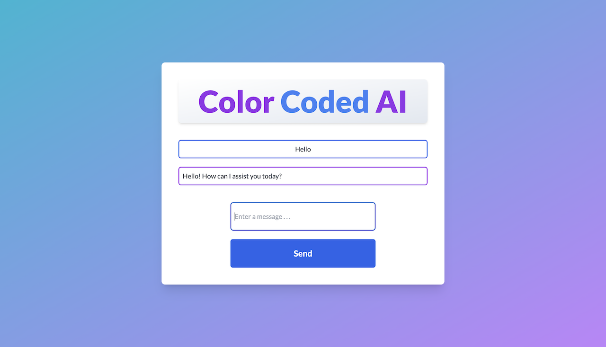

# Color Coded AI
## An example site using django, talwindcss, and the OpenAI APIs (Instructions below)

# Warning!
This is a production build and does not meet security standards for deployment. Please keep this in mind as you continue.

## Setup
If you are a member of the FHU computer science department, message Bryce Greene to receive a temporary API key and skip the following two steps.
* OpenAI's models are not free to use. Each user must set up their own account at https://openai.com and purchase credits from the billing page in account management.
* Once you have credits, use OpenAI's account management page to create an API key. Copy this key to a secure place. You will need later in the setup.

Once you have credits and an API key
* Download the zip file of the repository and open it on your computer.
* Open your preferred code editor
* In a terminal
  * navigate to the parent directory of the project
  * run the command `python -m venv venv && source venv/bin/activate`
  * run the command `pip install -r requirements.txt`
  * run the command `OPENAI_API_KEY='Your_api_key_here' > .env`
    * Make sure to paste your API key into the correct spot in the command or open the .env file and paste the key there
  * run the command `python manage.py runserver`
* Open a web browser and navigate to 127.0.0.1:8000
